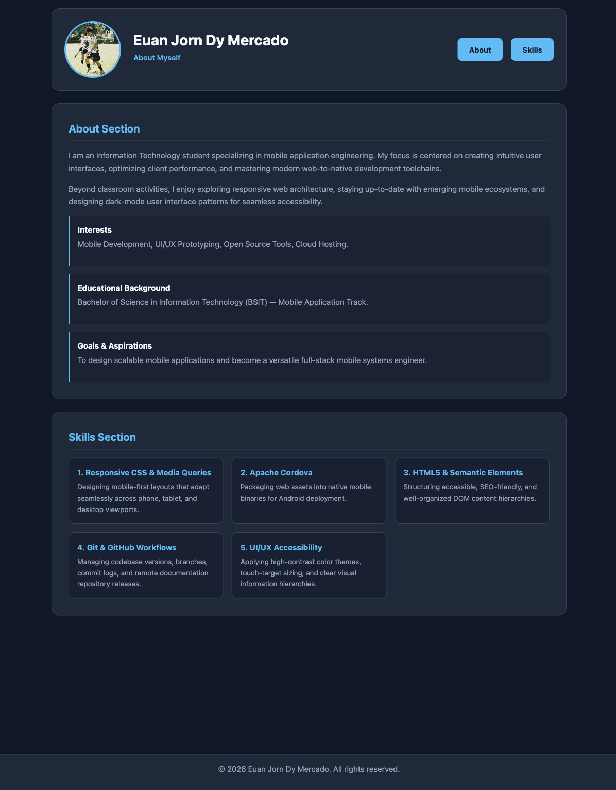
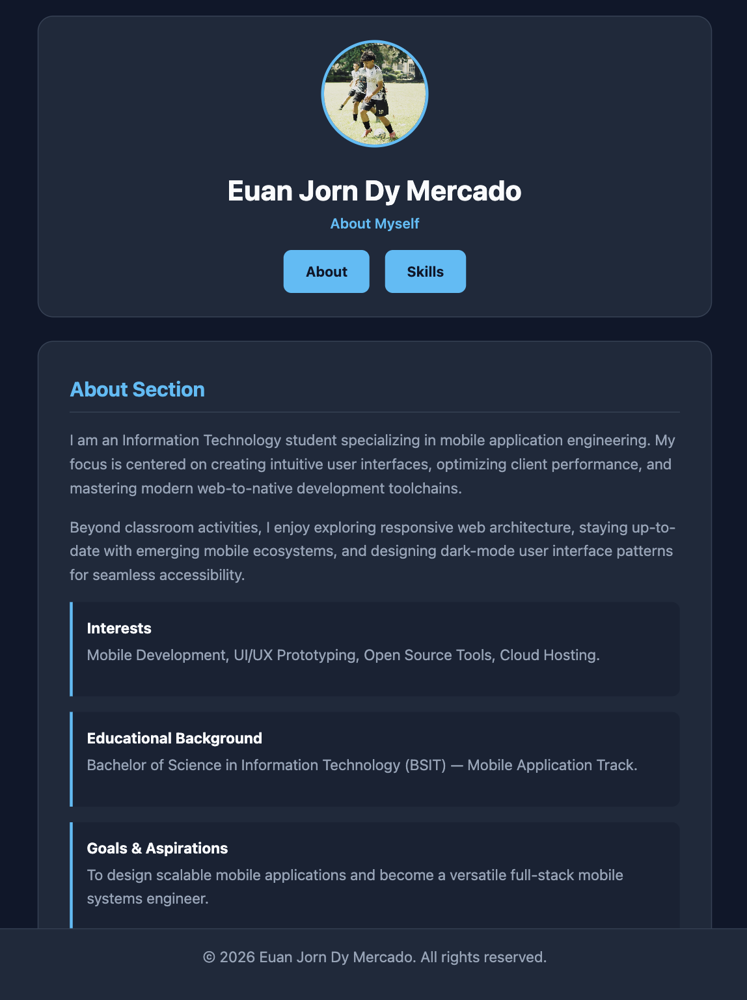
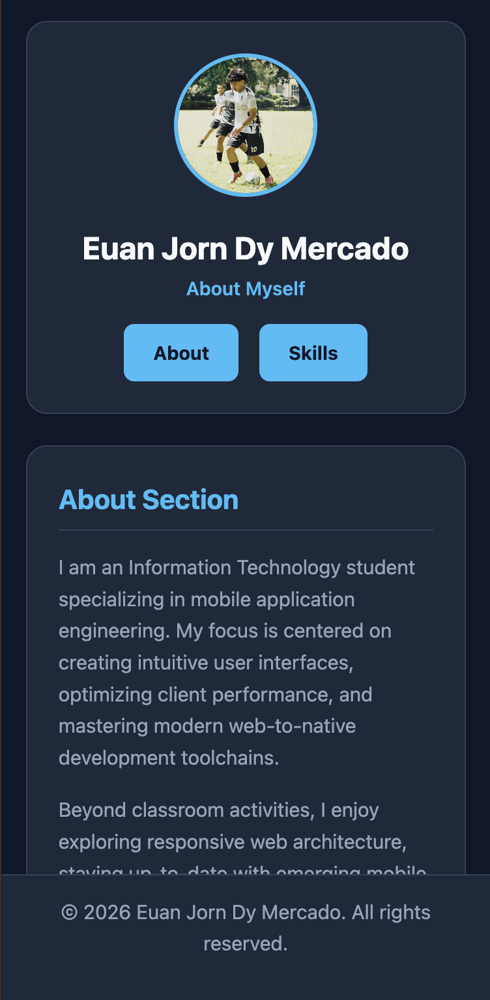

# Mercado_StudentProfile

A responsive mobile-first student profile web application packaged with Apache Cordova for ITCC 41.

## 1. Project Description
This Student Profile application displays personal details, interests, educational background, and technical skills. It has been enhanced using modern responsive CSS techniques and Mobile UI/UX principles to ensure optimal layout readability across mobile, tablet, and desktop viewports.

## 2. Application Structure
* **Header:** Displays the student's profile picture, full name, subtitle ("About Myself"), and navigation menu.
* **Navigation Menu:** Provides quick-access links to smooth-scroll directly to major content sections on the page.
* **About Section:** Details personal introductions, interests, educational background, and future aspirations.
* **Skills Section:** Features a grid displaying five core technical competencies with descriptions.
* **Footer:** Displays copyright details, student name, and the current year (2026).

## 3. Responsive Design
The application uses a mobile-first responsive design strategy implemented via CSS Flexbox, CSS Grid, and CSS `@media` queries:
* **Mobile Layout (<600px):** Single-column stacked cards, compact touch-friendly padding, and centered header items.
* **Tablet Layout (600px - 899px):** Two-column skills grid and expanded section padding.
* **Desktop Layout (≥900px):** Side-by-side header row, max-width content container (1000px), and a three-column skills grid.

## 4. UI/UX Principles Applied
* **Responsive Layout:** Eliminates horizontal scrollbars and text truncation across all screen sizes.
* **Mobile-Friendly Spacing:** Standardized rem-based padding and margins to prevent cramped elements on small viewports.
* **Appropriate Typography:** Uses scalable font sizes (`system-ui` font stack) with defined line heights for readability.
* **Clear Visual Hierarchy:** Distinct color accents (`#38bdf8`) highlight section titles, sub-headings, and primary actions.
* **Usable Controls:** Touch targets meet minimum height guidelines with distinct hover/focus states.
* **Basic Accessibility:** High-contrast dark theme, `alt` text on images, and semantic HTML tag usage.
* **Consistent Design:** Uniform color palette, border radius styles, and typography variables applied throughout.

## 5. Navigation
Navigation uses pure CSS fragment anchors (`#about` and `#skills`) paired with `:target` pseudo-class highlighting. No JavaScript is used for layout responsiveness or routing.

## 6. How to Run
```bash
cordova platform add android
cordova run android
```

## 7. Application Screenshots

### Desktop Layout


### Tablet Layout


### Mobile Layout
