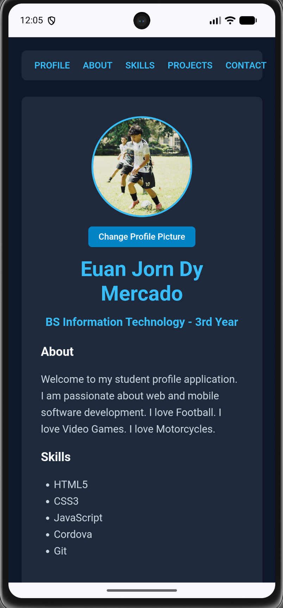
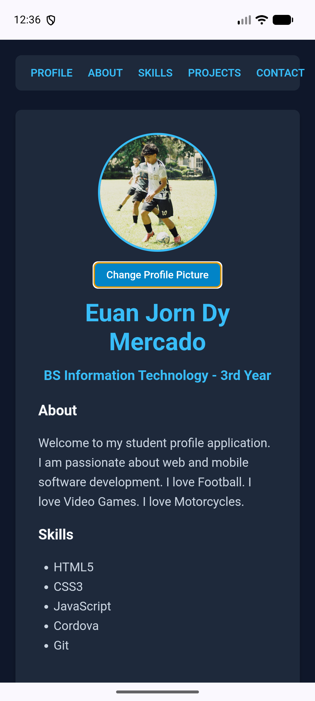
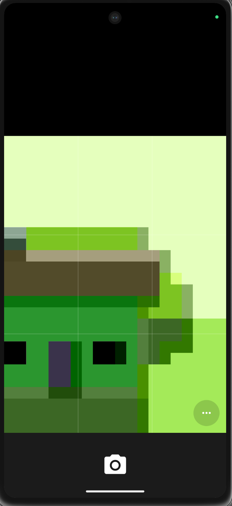
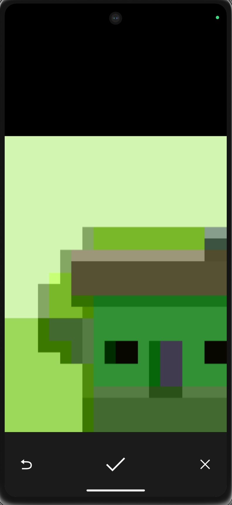
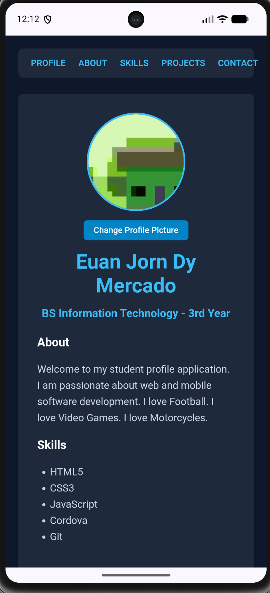

# Mercado_StudentProfile

A multi-page responsive student profile web application with dynamic profile editing, localStorage persistence, and native device camera integration packaged with Apache Cordova for ITCC 41.

## 1. Project Description
This application serves as an interactive Student Profile showcasing personal details, technical background, skills, projects, and contact information, enhanced with dynamic form editing and native device camera capabilities.

## 2. Application Pages
* **Profile (`index.html`):** Main entry point displaying profile data, profile picture, Change Profile Picture trigger, and Edit Profile form interface.
* **About (`about.html`):** Personal background, interests, and educational goals.
* **Skills (`skills.html`):** Overview of technical competencies and programming tools.
* **Projects (`projects.html`):** Portfolio showcasing previous development projects.
* **Contact (`contact.html`):** Direct contact options and interactive form layout.

## 3. Profile Editing
The Profile page includes an Edit Profile view that allows users to modify:
* Full Name, Course / Program, Year Level, About Me, and Skills.
* Form inputs validate required fields and save updates into `localStorage`.

## 4. Camera Integration
* **Trigger:** Tapping either the profile picture directly or selecting the `Change Profile Picture` button initiates the device camera[cite: 9].
* **Process:** `Change Profile Picture` → `Open Camera` → `Capture Image` → `Update Profile Picture`.
* Uses `cordova-plugin-camera` via `navigator.camera.getPicture` with `DATA_URL` (Base64) encoding[cite: 9, 10].

## 5. Device Feature Integration
Cordova acts as a bridge between web technology and native hardware, giving JavaScript direct access to Android device APIs such as hardware camera capture without requiring native Java/Kotlin code.

## 6. Image Handling
* Upon successful capture, the image data is formatted as a Base64 string (`data:image/jpeg;base64,...`)[cite: 9].
* The Base64 string is assigned to the profile DOM image tag and saved inside `localStorage` under the `studentProfile` key[cite: 10].
* The photo persists seamlessly across application restarts[cite: 10].

## 7. Error Handling
* **Permission / Access Denial:** Displays a non-crashing alert message ("Unable to access the camera. Please check your device permissions.") if access fails[cite: 10].
* **Cancellation:** If the camera operation is cancelled by the user, the application gracefully retains the existing profile photo without crashing[cite: 10].

## 8. Responsive Design
* **Desktop (≥900px):** Centered view container with high legibility.
* **Tablet (600px - 899px):** Balanced scaling and touch navigation.
* **Mobile (<600px):** Single-column stacked form elements and touch-friendly targets.

## 9. How to Run
```bash
npm install
cordova plugin add cordova-plugin-camera
cordova platform add android
cordova run android
```

## 10. Application Screenshots

### Student Profile


### Change Profile Picture


### Camera


### Captured Image


### Updated Profile Picture

