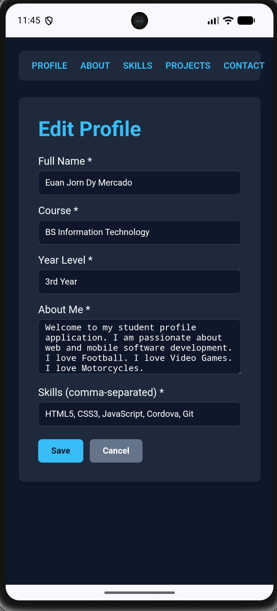
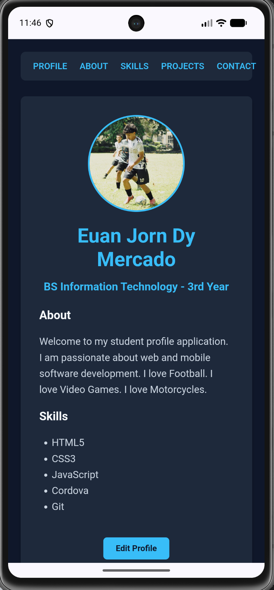
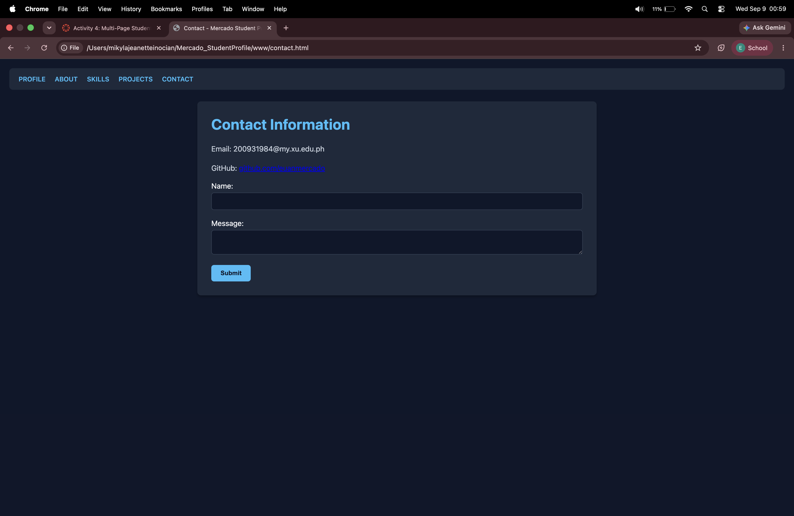

# Mercado_StudentProfile

A multi-page responsive student profile web application with dynamic profile editing, localStorage persistence, and JavaScript validation, packaged with Apache Cordova for ITCC 41.

## 1. Project Description
This application serves as a multi-page Student Profile showcasing personal details, technical background, skills, projects, and contact information, upgraded with real-time profile editing.

## 2. Application Pages
* **Profile (`index.html`):** Main entry point displaying profile data with an interactive Edit Profile interface.
* **About (`about.html`):** Personal background, interests, and educational goals.
* **Skills (`skills.html`):** Overview of technical competencies and programming tools.
* **Projects (`projects.html`):** Portfolio showcasing previous development projects.
* **Contact (`contact.html`):** Direct contact options and interactive form layout.

## 3. Profile Editing
The Profile page includes an Edit Profile view that allows users to modify:
* Full Name
* Course / Program
* Year Level
* About Me text
* Listed Skills

## 4. JavaScript Functionality
* **Form Handling:** Intercepts submission events to process data dynamically without browser reloads.
* **Validation:** Prevents saving empty fields and displays feedback if required inputs are missing.
* **Profile Updates:** Instantly updates DOM elements upon saving.
* **Save & Cancel:** The Save button commits validated data, while Cancel discards pending changes and restores original profile values.

## 5. Local Data Storage
* Uses `localStorage` to store serialized profile data under the `studentProfile` key.
* Automatically loads saved data on application start, falling back to default values when no saved profile exists.

## 6. Responsive Design
The application layout dynamically adapts across all device viewports:
* **Desktop (≥900px):** Constrained, centered container for maximum legibility.
* **Tablet (600px - 899px):** Medium-width scaling and touch-friendly nav elements.
* **Mobile (<600px):** Stacked single-column inputs and full-width buttons.

## 7. How to Run
```bash
cordova platform add android
cordova run android
```

## 8. Application Screenshots

### Student Profile


### Edit Profile


### Updated Profile


### Contact Page

