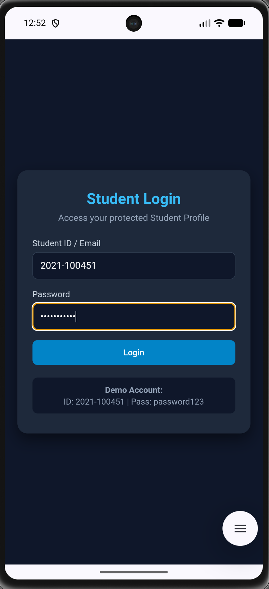
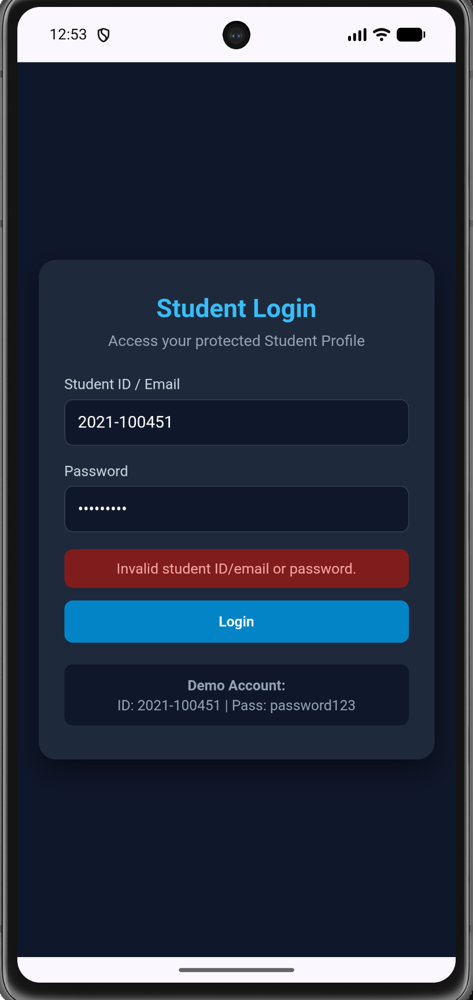
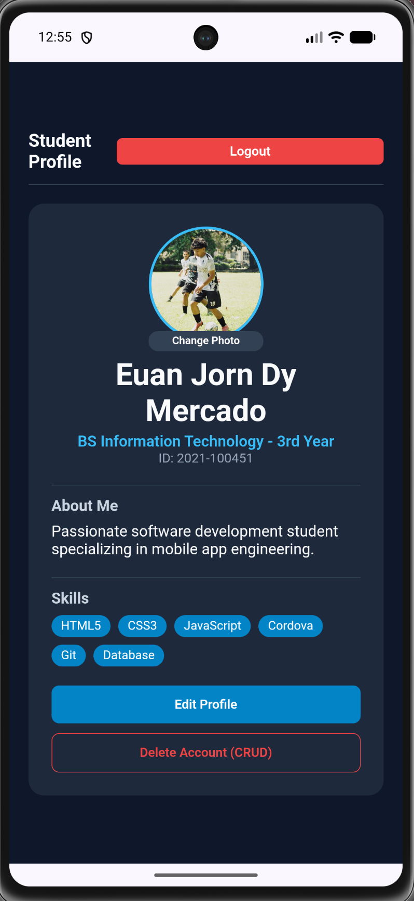
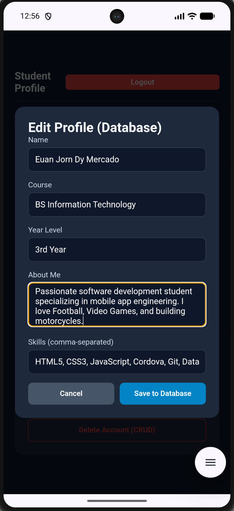
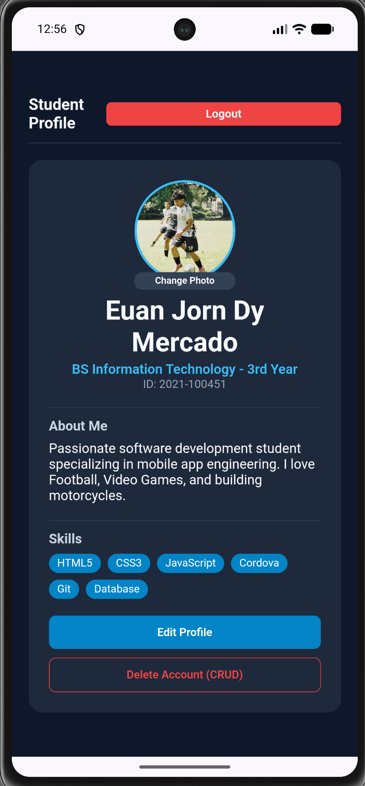
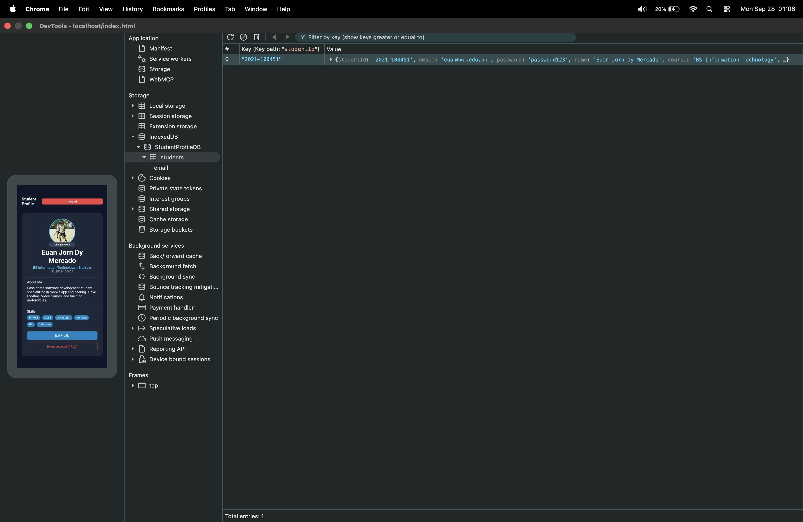
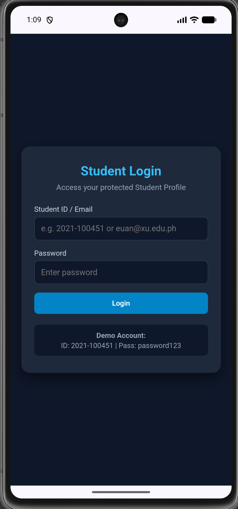

# Mercado_StudentProfile - Activity 7: Database Integration & Authentication

A responsive Apache Cordova mobile application featuring user authentication, database persistence (IndexedDB), full CRUD operations, and native device camera integration for ITCC 41.

---

## 1. Project Description
This application serves as an interactive, database-driven Student Profile application. It expands upon Activity 6 by replacing plain local storage with an asynchronous database engine, enforcing authentication via a Login page, and allowing full CRUD (Create, Read, Update, Delete) management of student profile records.

---

## 2. Application Pages
* **Login Page**: Protected gateway requiring Student ID / Email and password authentication before granting profile access.
* **Student Profile Page**: Primary dashboard displaying database-stored student details (Name, Course, Year Level, Student ID, About Me, Skills, Profile Picture).
* **Edit Profile Modal**: Form view allowing authenticated users to update their profile information directly in the database.

---

## 3. Authentication
The application enforces strict access control to protect student information:
* **Workflow**: Login -> Authenticate Credentials -> Grant Session Token -> Display Student Profile
* Unauthenticated users attempting to bypass the login screen are denied access and redirected to login.
* Passwords are validated asynchronously against stored records in the database.

---

## 4. Student Profile Management
Authenticated students can perform complete profile management:
* View profile data loaded directly from database stores.
* Edit personal details (Name, Course, Year Level, About Me, Skills).
* Update profile picture using native device camera integration.
* Terminate sessions using the Logout button.

---

## 5. Database Integration
The application uses an asynchronous database engine (IndexedDB) to persist profile records locally on the device:
* **Student ID**: Primary key identifier (e.g., 2021-100451).
* **Name, Course, Year Level**: Core student attributes.
* **About Me & Skills**: Profile content fields.
* **Profile Picture**: Base64 image data URI / asset path reference.

---

## 6. API / Backend Architecture
Cordova Application -> IndexedDB Engine -> Native Storage

---

## 7. CRUD Operations
* **Create**: Seeded initial student profile and new profile record creation.
* **Read**: Asynchronous query retrieving student records upon successful login.
* **Update**: Modifying existing record fields and updating the corresponding database entry.
* **Delete**: Explicit delete operation for removing student records from the database.

---

## 8. Camera Integration
Retains the cordova-plugin-camera native device camera implementation from Activity 6. Photos captured from the device camera are encoded into Data URLs and persisted directly inside the student's database record.

---

## 9. Data Persistence
Profile changes remain fully persistent across:
* Closing and reopening the application.
* Device restarts.
* Logging out and logging back in.

---

## 10. Responsive Design
Styled with a modern dark theme using modern CSS flexbox and media queries to ensure smooth layout adaptation across mobile, tablet, and desktop viewports.

---

## 11. Security
* Credentials and session tokens (`auth_token`) are managed in memory/local storage without exposing sensitive keys.
* Repository configured with `.gitignore` to prevent committing sensitive files.

---

## 12. How to Run
1. Clone Repository: `git clone https://github.com/euanmercado/Mercado_StudentProfile.git`
2. Install Cordova: `npm install -g cordova`
3. Add Android Platform: `cordova platform add android`
4. Run Application: `cordova run android`

---

## 13. Test Accounts
* **Student ID / Email**: `2021-100451` or `euan@xu.edu.ph`
* **Password**: `password123`

---

## 14. Application Screenshots

### 1. Login Page

### 2. Login Error (Validation Test)

### 3. Profile Dashboard (Database Read)

### 4. Edit Profile Modal (Database Update Form)

### 5. Updated Profile View

### 6. IndexedDB Storage Verification

### 7. Account Deletion (CRUD Delete)

